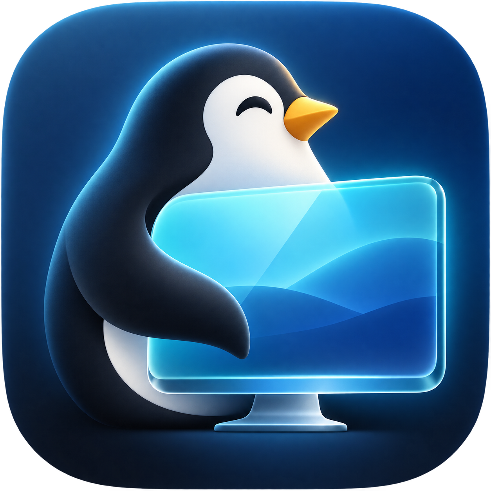

<p align="center">
  
</p>

<h1 align="center">TuxPane</h1>
<p align="center"><b>Your Linux desktop, right on your Mac.</b></p>

TuxPane shows your Linux computer's desktop in a window on your Mac and lets you use it as if it were part of the Mac:

- **Every shortcut works:** ⌘C, ⌘V, ⌘Tab and ⌘Space go to Linux (⌘ acts as Ctrl).
- **Smooth and sharp:** hardware-accelerated video at up to 60 fps.
- **Shared clipboard:** copy on one, paste on the other.
- **Private:** encrypted, and only reachable from your home network or [Tailscale](https://tailscale.com).

---

## What you need

| | Requirement |
|---|---|
| **Mac** | macOS 14 (Sonoma) or newer |
| **Linux** | An **X11 / Xorg** desktop (Linux Mint, Ubuntu or Fedora on "Xorg"; Wayland isn't supported yet), Python 3.10+, `systemd` |
| **Network** | Both on the same home network, **or** both on Tailscale |

Headless Linux box with no monitor? Turn on **automatic login** for your user and plug in an **HDMI dummy plug**, so there is a desktop to show.

---

## Setup (about 5 minutes)

### Step 1 · Install the Mac app

The ready-to-download Mac app is coming soon. For now, build it with one command. Open the **Terminal** app on your Mac and run:

```bash
xcode-select --install
```
(Skip this if Apple's developer tools are already installed. If it says "already installed", that's fine.)

```bash
git clone https://github.com/vinoth12940/tuxpane.git
cd tuxpane
./scripts/build-app.sh
open ~/Applications/TuxPane.app
```

TuxPane opens on the **Welcome** screen. Click **Get Started**, and it shows the Linux install command.

### Step 2 · Install on your Linux machine

Open a terminal **on the Linux machine**, signed in as the user who is logged in to the desktop. Either:

- sit at the Linux machine and press **Ctrl + Alt + T**, **or**
- from your Mac's Terminal, connect with SSH: `ssh your-linux-user@your-linux-address`

Then paste this command (the app has a **Copy** button for it):

```bash
curl -fsSL https://github.com/vinoth12940/tuxpane/releases/latest/download/install.sh | bash
```

The installer checks everything and shows a checklist:

```
TuxPane 1.0.0 · Linux setup

  ✓ Desktop session      X11 on :0
  ✓ Required packages    all present
  ✓ Video encoder        GPU hardware (VAAPI) · 2560×1600
  ✓ Security keys        created
  ✓ Background service   running · port 7300
```

Answer its questions:

- **Missing packages?** It shows the exact install command and asks before using `sudo`.
- **"Match your Mac's resolution?"**: press **Enter** (yes) for headless machines; answer `n` if the machine has its own monitor you use.
- **"ufw is on. Allow TuxPane from your home network?"**: type **y**. Otherwise your Mac can only find the machine over Tailscale.

It ends with **"Open TuxPane on your Mac and choose `<your-machine>`"** and waits for up to 10 minutes. Leave it open.

### Step 3 · Pair your Mac

Back in TuxPane, click **Continue**:

1. Your Linux machine appears with a green **Ready to pair** badge. Click it, then **Pair**.
   *(macOS may ask to let TuxPane find devices on your local network: click **Allow**. Not on the same Wi-Fi? Type the machine's Tailscale name or `100.x` address instead.)*
2. The Mac and the Linux terminal now show **the same 6-digit code**. Check they match.
3. In the Linux terminal, type **y** and press **Enter**. Then click **They Match** on the Mac.

### Step 4 · Allow the keyboard

So that ⌘Tab and ⌘Space go to Linux instead of your Mac, click **Open System Settings**, and switch **TuxPane** on under **Privacy & Security → Accessibility**. The app notices by itself. Then click **Start Using TuxPane**.

**Done: your Linux desktop appears.** 🎉

---

## Everyday use

- **Open TuxPane** and it connects to your Linux machine straight away. No setup again.
- **Give the keyboard back to the Mac:** press **Ctrl + Option + Esc**. Click the Linux picture to take it again.
- **Menu bar in full screen:** move the pointer to the top edge of the screen.
- **Several Linux machines, or a sharper/faster picture:** close the Linux window to see **Your machines**. Pick a resolution (*Balanced*, *Sharp*, *Fast*) or add another machine.

## Commands on Linux

```bash
tuxpane status          # Is it running? Which addresses? Recent log
tuxpane pair            # Pair another Mac (compare the 6-digit code)
tuxpane pair --code     # Print a code to paste into the Mac instead
tuxpane pair --reset    # New keys: unpairs every Mac (then pair again)
tuxpane update          # Install the latest release
tuxpane uninstall       # Remove TuxPane from this machine
```

If the `tuxpane` command isn't found, use `~/.local/bin/tuxpane`.

## If something doesn't work

| Problem | Fix |
|---|---|
| The machine doesn't appear in the list | The installer (or `tuxpane pair`) must be running on Linux. If Linux has a firewall, allow it (see Step 2). Or type the machine's address / Tailscale name. |
| "The installer says Xorg is required" | Log out, pick "… on Xorg" at the login screen, and run the installer again. |
| "The machine's security certificate has changed" | Expected after `tuxpane pair --reset` or a reinstall. Click **Pair Again** and run `tuxpane pair` on Linux. |
| ⌘Tab still switches Mac apps | Switch on TuxPane under **Accessibility** (Step 4). |
| Black screen / "can't capture its screen" | A user must be logged in to the Linux desktop. Headless: auto-login + dummy plug. |

More help: [Troubleshooting](docs/troubleshooting.md) · Full details: [Setup guide](docs/setup.md) · [Security](docs/security.md)

## Uninstall

- **Linux:** `tuxpane uninstall`
- **Mac:** quit TuxPane and delete `~/Applications/TuxPane.app`

## Security in short

- **Encryption:** all traffic uses TLS 1.3, and the Mac only trusts the exact certificate it paired with.
- **Pairing needs a person at both screens:** they must confirm the same code, and the secret key is sent only after that. It's stored in the macOS Keychain.
- **Private networks only:** the Linux side accepts connections only from home networks and Tailscale, never from the internet.

Details: [docs/security.md](docs/security.md)

## For developers

Never commit real IP addresses, hostnames, emails or keys; use made-up examples. Turn on the leak-check hooks once per clone:

```bash
git config core.hooksPath .githooks
cd agent && python3 -m unittest discover -s tests -t .
cd mac && swift test --scratch-path "$HOME/Library/Caches/TuxPane/build"
./scripts/package-agent.sh   # builds dist/tuxpane-agent-<version>.tar.gz + dist/install.sh
```

To test the Linux installer from a local build before it's released:

```bash
scp dist/tuxpane-agent-1.0.0.tar.gz dist/install.sh you@linux:/tmp/
ssh -t you@linux 'TUXPANE_TARBALL=/tmp/tuxpane-agent-1.0.0.tar.gz bash /tmp/install.sh'
```

## License

[MIT](LICENSE)
